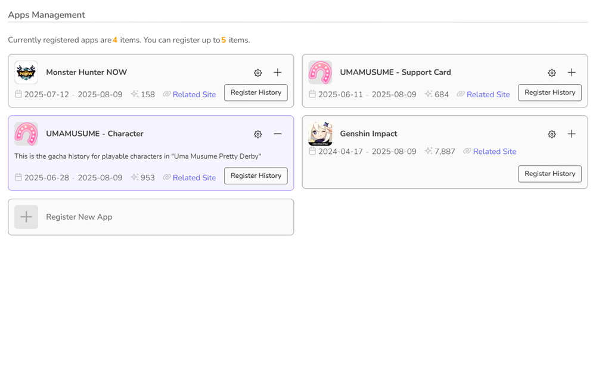
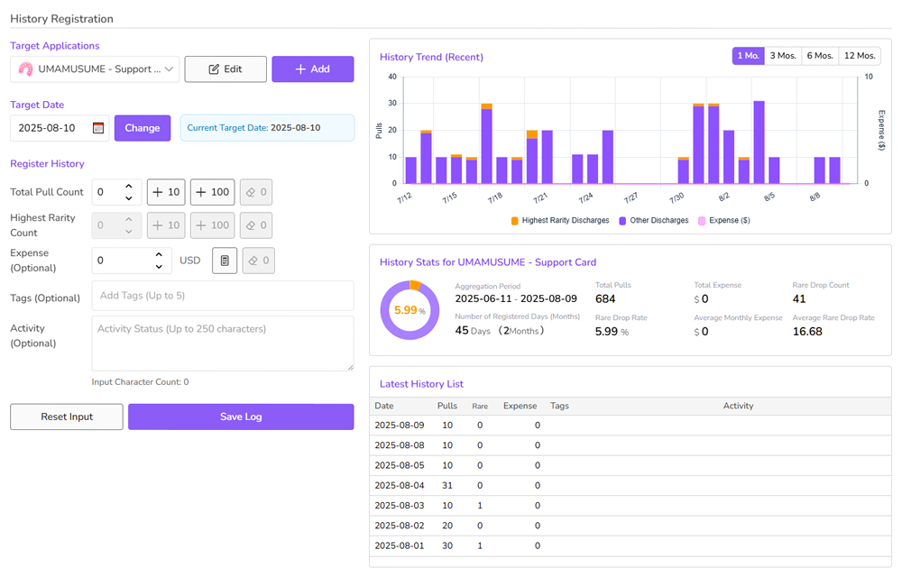
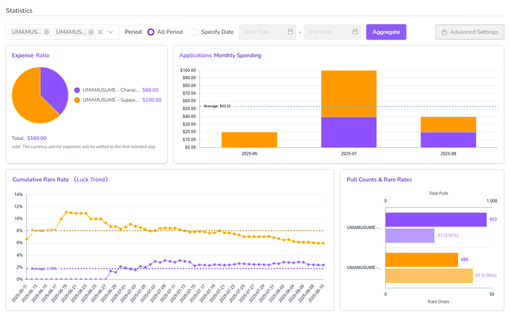

# PullLog Frontend

個人のガチャ履歴を記録・管理するWebアプリ「PullLog」のフロントエンドリポジトリです。  
本アプリはNuxt.js 3 + PrimeVue 4 + Pinia 3 + TailwindCSS 4 + TypeScript + Luxon + Chart.jsを中心技術として構築されています。

#### スクリーンショット

|  |  |  |
|:---:|:---:|:---:|
| アプリ管理 | 履歴登録・管理  | 統計・分析 |

---

## 目次

- [主な特徴](#主な特徴)
- [技術スタック](#技術スタック)
- [セットアップ方法](#セットアップ方法)
- [ディレクトリ構成](#ディレクトリ構成)
- [主要な設計・開発指針](#主要な設計開発指針)
- [ストア責務分離方針](#ストア責務分離方針)
- [コーディング規約](#コーディング規約)
- [開発・運用Tips](#開発運用tips)
- [デプロイ・ホスティング](#デプロイ・ホスティング)
- [ライセンス](#ライセンス)
- [コントリビューション](#コントリビューション)
- [関連リンク](#関連リンク)

---

## 主な特徴

- 個人のガチャ履歴（タイトル・日付・回数・最高レア・課金額・タグ等）を直感的UIで登録・管理
- PrimeVueベースの快適なUI/UX
- Luxonを用いたタイムゾーン対応
- Chart.jsによる可視化グラフ（回数推移・課金推移など）
- ピンポイントキャッシュや最適化済みPiniaストア
- Zodを使った型安全なフォームバリデーション
- SCSSによる柔軟なカスタムスタイリング
- テーマ切り替え（ダーク／ライト）機能
- UIの言語切り替え（日本語／英語／中国語）機能（※ v1時点）
- ソーシャルログイン対応（※ v1時点では Google OAuth のみ）
- 認証付き・API連携（詳細はサーバーリポジトリ参照）

---

## 技術スタック

- **フレームワーク**: Nuxt.js v3.17.5
- **UIフレームワーク**: PrimeVue v4.3.5
- **状態管理**: Pinia v3.0.3
- **スタイル**: TailwindCSS v4.1.10, SCSS
- **言語**: TypeScript
- **日付管理**: Luxon v3.6.1
- **グラフ描画**: Chart.js v4.5.0
- **マークダウン制御**: Marked v15.0.12
- **ソート制御**: SortableJS v1.15.6
- **バリデーション**: Zod v3.25.67
- **パッケージ管理**: pnpm
- **API通信**: fetch（useFetchは非推奨／APIプロキシ・`.env`/runtimeConfig経由で設定）
- **その他**: Ulid, ESLint, PostCSS, TypeDoc, Biomeなど

---

## セットアップ方法

### 1. 必須環境

- Node.js (v20以上推奨)
- pnpm

### 2. .envファイルの作成

- APIエンドポイントや各種秘匿情報は `.env` ファイルで管理できます。
- 必要に応じて下記のようなファイルをルート直下に作成してください。

```dotenv
# .env.example
APP_NAME=PullLog
APP_VERSION=0.9.0
COPYRIGHT=© 2025 MAGIC METHODS
DEFAULT_LOCALE=en

API_BASE_URL=http://localhost:3000/api
API_PROXY=/api
SECRET_API_KEY=foo-bar-1234

GA_ID=G-xxxxxxxxxx
GOOGLE_ADSENSE_ACCOUNT=ca-pub-xxxxxxxxxxxxxxxx
GOOGLE_CLIENT_ID=xxxxxxxxxx-xxxxxxxxxx.apps.googleusercontent.com

DEMO_EMAIL=
DEMO_PASSWORD=

IS_DEBUG=true
MOCK_MODE=false
```

- `.env` ファイルはGit管理対象外（`.gitignore`）です。
- 複数環境（ローカル・本番など）で値を切り替えて運用します。

### 3. インストール

```sh
pnpm install
```

### 4. 開発サーバ起動

```sh
pnpm run dev
```

- `http://localhost:3000` でアプリが起動します
- APIバックエンド（pullog-api等）も別途起動しておいてください
- **APIエンドポイント（例： `/api/` など）へのリクエストは、フロントエンドからバックエンドサーバへプロキシ経由（ `nuxt.config.ts` で設定）で自動ルーティングされます。**  
ローカル開発時は `API_BASE_URL` の設定やCORS制御の心配なく利用できます。本番ビルド時は実サーバ用のAPI URLを `app.config.ts` で指定してください。
- VHOST設定等で localhost 以外のホストを利用すると Google OAuth が失敗するため、ソーシャル連携ログインをする場合のホスト名は localhost 固定化が必須です。

### 5. 本番ビルド

```sh
pnpm run build
pnpm run preview
```

---

## ディレクトリ構成

※主要部分抜粋

```plaintext
/
├── components/         # Vueコンポーネント群
│    ├── chart/        # 個別グラフコンポーネント群
│    ├── common/       # 共通コンポーネント群
│    └── ***.vue       # 各種コンポーネント
├── composables/        # カスタムフック・共通ロジック
│    ├── useAdManager.ts
│    ├── useAPI.ts     # API制御コンポーザブル
│    ├── useAuth.ts    # 認証制御コンポーザブル
│    ├── useChart.ts   # グラフ制御コンポーザブル
│    ├── useConfig.ts
│    ├── useConsent.ts
│    ├── useGoogleAuth.ts
│    ├── useMarkdownContent.ts
│    ├── usePkce.ts
│    ├── useStats.ts
│    └── useWebIcon.ts # Webアイコン制御コンポーザブル
├── config/             # アプリ設定（リポジトリ管理下からは除外）
├── directives/         # Vueディレクティブ拡張
├── i18n/               # ロケール定義
│    └── locales/      # 言語ファイル群
├── layouts/            # レイアウトファイル
│    ├── auth.vue      # 認証画面系レイアウト
│    ├── default.vue   # アプリ画面レイアウト
│    ├── error.vue     # エラー画面レイアウト
│    └── landing.vue   # ランディングページレイアウト
├── middleware/         # ミドルウェア（認証ガード等）
├── pages/              # ルーティング単位ページテンプレート
│    ├── auth/         # 非認証系ルーティングページ
│    ├── error/        # エラー系ルーティングページ
│    ├── index.vue     # ランディングページ
│    └── ***.vue       # 認証済みルーティングページ
├── plugins/            # 各種プラグイン
├── public/             # 静的ファイル
│    ├── docs/         # 各種文書Markdown群（利用規約など）
│    └── images/       # 公開用画像群
├── stores/             # Piniaストア定義
│    ├── globalStore.ts    # グローバルストア
│    ├── useUserStore.ts   # ユーザー管理
│    ├── useAppStore.ts    # アプリケ―ション管理
│    ├── useLogStore.ts    # 履歴データ管理
│    ├── useStatsStore.ts  # 統計データ管理
│    ├── useOptionStore.ts # プリセット・オプション管理
│    ├── useCsrfStore.ts   # CSRFトークン管理
│    └── useLoaderStore.ts # ローディング状態管理
├── theme/              # PrimeVueテーマ定義
│    ├── preset.ts     # グローバルプリセット定義
│    └── ptPreset.ts   # 各コンポーネントPassThrough定義
├── types/              # 型定義
├── utils/              # 共通ユーティリティ
├── assets/styles/      # ビルトインスタイル群
│    ├── index.scss    # オーバーライドスタイルインポータ―
│    ├── _***.scss     # 各種オーバーライドスタイル定義
│    ├── tailwind_v4.scss # TailwindCSS拡張スタイルインポータ―
│    └── _twe-***.scss # 各種TailwindCSS拡張スタイル定義
├── api/                # API定義
│    ├── endpoints.ts  # RESTエンドポイント定義（APIプロキシまで）
│    └── index.ts      # サービスレイヤー用ラッパーメソッド（未使用）
├── server/             # サーバーサイド処理（Nitro用）
│    ├── api/          # APIプロキシ（RESTエンドポイント準拠）
│    │    ├─ apps/
│    │    ├─ auth/
│    │    ├─ logs/
│    │    ├─ stats/
│    │    ├─ user/
│    │    └─ [...path].ts # APIプロキシ・フォールバック
│    └── utils/        # APIプロキシ用ユーティリティ
├── .env                # 環境設定
├── app.vue             # アプリケーションコンテナ
├── app.config.ts       # Nuxtアプリ設定
├── tailwind.config.ts  # TailwindCSS設定
├── nuxt.config.ts      # Nuxt設定
├── package.json        # パッケージ管理
└── README.md           # このファイル
```

---

## 主要な設計・開発指針

- **ストアの責務分離**  
各ストアは以下の責務を担います（詳細は各ファイルコメント参照）
  - `useUserStore`: ユーザー認証・情報管理
  - `useAppStore`: アプリケーション情報
  - `useLogStore`: ガチャ履歴ログ取得・キャッシュ
  - `useStatsStore`: 統計値管理・計算
  - `useOptionStore`: ユーザー設定・選択肢
  - `useCsrfStore`: CSRFトークン管理
  - `useLoaderStore`: グローバルローディング状態管理
  - `globalStore`: 他で使わないグローバルな値の一時保持
- **型安全**  
すべて TypeScript で実装、`any` や非nullアサーション（`!`）は（原則）禁止。型定義は `types/` へ集約し、 `declare global {...}` でオートインポートに対応させる。
- **日付管理**  
Luxon を利用し、全て ISO8601 文字列または Date 型で厳密管理。
- **グラフ**  
Chart.js を直接ラップした共通コンポーネントを用意し、テーマ切り替え時もリアルタイム反映。
- **フォームバリデーション**  
PrimeVue の Form は使用せず、 Zod によるバリデーションのみ使用。
- **SCSSスタイル**  
`assets/styles` 配下にSCSSで記述。TailwindCSSで基本設計し、細かい上書きはSCSSで。  
原則コンポーネント側にスタイルタグ（scoped）は埋め込まず、必要に応じて PrimeVue の PassThrough や `computed` で対応する。
- **ロケール**
i18n によるロケール管理を行い、View側のコードは原則として `t()` メソッドでの翻訳テキスト引き当て方式で記述する。

---

## ストア責務分離方針

- **状態管理の粒度：**  
1つのストアに複数の責務を持たせず、担当範囲を限定
- **キャッシュ制御：**  
不要なキャッシュは必ず破棄。エラー時や未取得データはキャッシュしない（特に空配列キャッシュに注意）
- **再利用性・テスタビリティ：**  
ロジックは Pinia ストアか composables に集約し、Vueコンポーネントは出来る限りUIに専念させる

---

## コーディング規約

- インデントは**スペース4つ**
- セミコロンは原則**不要**
- 非nullアサーション（`!`）は禁止
- 型安全最優先。`any`は原則禁止
- SCSSまたはTailwindでスタイル
- composable/コンポーネントにはTypeDoc準拠のJSDocコメント推奨
- API通信にはfetch（useFetchは不使用）

---

## 開発・運用Tips

- APIエンドポイント定義は `utils/endpoints.ts` で一元管理
- テーマ/ロケール等の設定値は `useOptionStore` およびローカルストレージに保存
- テーマ切り替え時の遅延はグローバルCSSに `transition: none !important` を一時的に付与することで解消
- マークダウンファイルをfetchで取得する場合は `public/` 配下に配置
- エラー画面カスタマイズは `layouts/error.vue` で対応（Nuxtのデフォルトと競合する場合は注意）
- コミット前に必ず `pnpm run lint` を実行
- **APIプロキシ設定**
  - Nuxtの`nuxt.config.ts`にて `/api/` などのパスは自動でバックエンドAPI（`API_BASE_URL`）へプロキシ転送されるように設定済み
  - 開発時はCORS問題を気にせずAPI通信が可能
  - バックエンドのURLを切り替える場合は `runtimeConfig` の `apiBaseURL` を編集
  - `fetch`などでのリクエスト先は絶対パス・相対パスどちらでも可（詳細は`composables/useAPI.ts`等参照）
- **runtimeConfig / .env管理**
  - Nuxt 3の `runtimeConfig`（`nuxt.config.ts` の `runtimeConfig` セクション）で環境ごとの設定値（APIエンドポイント等）を一元管理
  - 例えば `process.env.API_BASE_URL` は `useRuntimeConfig().public.apiBaseURL` から取得可能
  - 開発/本番でのAPIルートの切り替えは `.env` または `nuxt.config.ts` の該当箇所を編集
  - **.envの変更を反映するには、開発サーバ再起動が必要**

---

## デプロイ・ホスティング

mainブランチへのpush時に本番ビルドが行われ、ホスト先である Cloudflare に自動でデプロイされます。  

- 以下、コマンドラインからの手動デプロイの方法を記載予定  

- さらに Cloudflare でのホスティングの設定等を追記予定  

なお、NitroのNodeサーバでAPIプロキシを動かす必要があるため、 Cloudflare Workers でのホスティング必須です。  

---

## ライセンス

MAGIC METHODS に帰属します。

---

## コントリビューション

関係各位のPull Request・Issue歓迎です。  
設計や方針の議論はDiscussionsまたはIssueで行ってください。

---

## 関連リンク

- [PullLog バックエンドリポジトリ](https://github.com/magicmethods/pulllog-backend)
- [PullLog API仕様書](https://github.com/magicmethods/pulllog-contract)
- ドキュメント
  - [利用規約（日本語）](https://github.com/magicmethods/pulllog-frontend/blob/main/public/docs/terms_ja.md)
  - [利用規約（English）](https://github.com/magicmethods/pulllog-frontend/blob/main/public/docs/terms_en.md)
  - [利用規約（中国語・簡体字）](https://github.com/magicmethods/pulllog-frontend/blob/main/public/docs/terms_zh.md)
  - [プライバシーポリシー（日本語）](https://github.com/magicmethods/pulllog-frontend/blob/main/public/docs/privacy_policy_ja.md)
  - [プライバシーポリシー（English）](https://github.com/magicmethods/pulllog-frontend/blob/main/public/docs/privacy_policy_en.md)
  - [プライバシーポリシー（中国語・簡体字）](https://github.com/magicmethods/pulllog-frontend/blob/main/public/docs/privacy_policy_zh.md)

---

**（補足）**  
運用や設計方針の見直しは適宜Issue/PRで反映していきます。最新情報はGitHubリポジトリおよび本READMEを参照してください。
