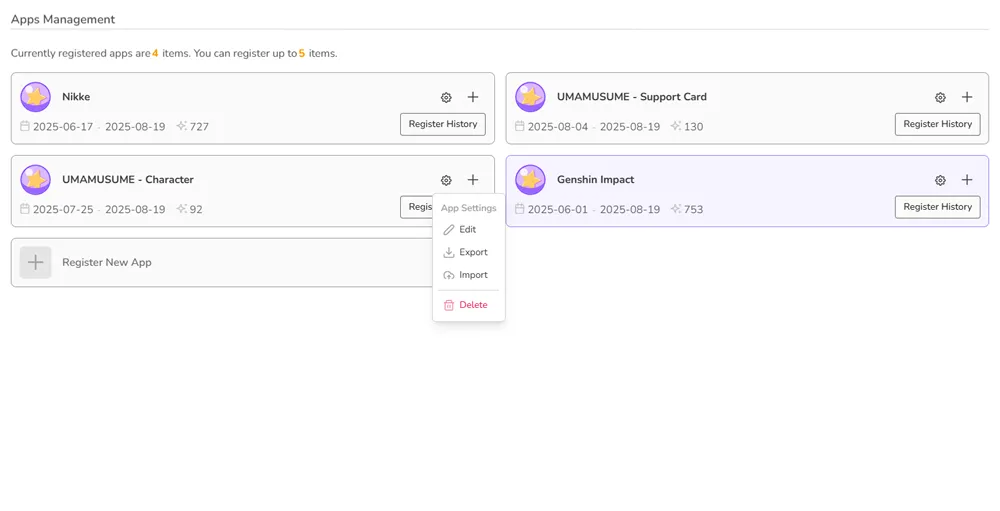
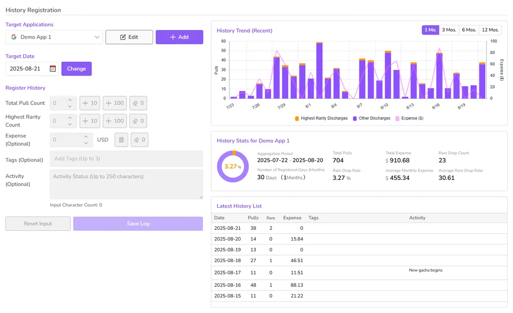
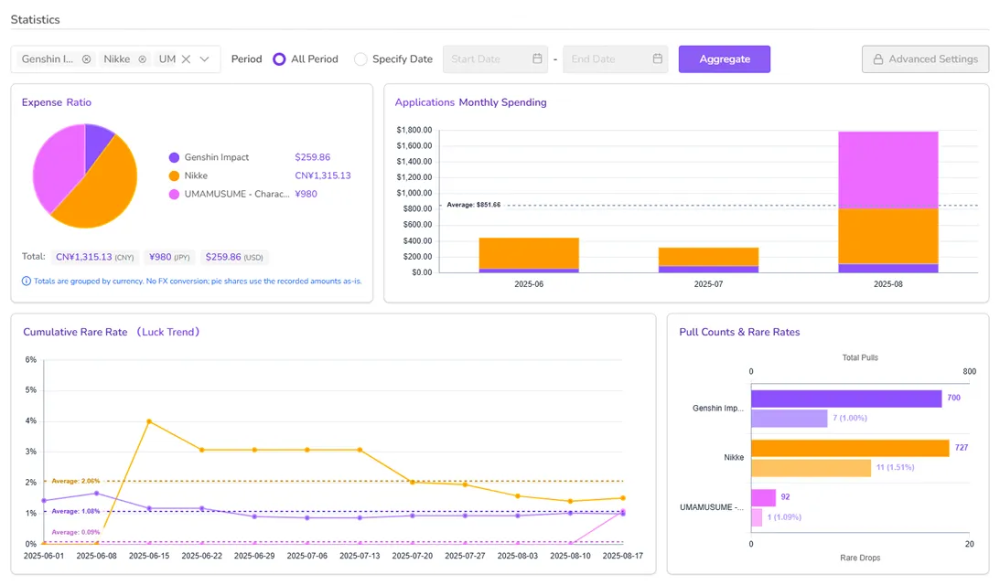

# PullLog Frontend

個人のガチャ履歴を記録・管理するWebアプリ「PullLog」のフロントエンドリポジトリです。  
本アプリはNuxt.js 3 + PrimeVue 4 + Pinia 3 + TailwindCSS 4 + TypeScript + Luxon + Chart.jsを中心技術として構築されています。

#### スクリーンショット

|  |  |  |
|:---:|:---:|:---:|
| アプリ管理 | 履歴登録・管理  | 統計・分析 |

---

## 目次

- [主な特徴](#主な特徴)
- [技術スタック](#技術スタック)
- [設計・運用ドキュメント](#設計運用ドキュメント)
- [セットアップ方法](#セットアップ方法)
- [E2Eテスト](#e2eテスト)
- [ディレクトリ構成](#ディレクトリ構成)
- [主要な設計・開発指針](#主要な設計開発指針)
- [ストア責務分離方針](#ストア責務分離方針)
- [コーディング規約](#コーディング規約)
- [開発・運用Tips](#開発運用tips)
- [デプロイ・ホスティング](#デプロイ・ホスティング)
- [ライセンス](#ライセンス)
- [コントリビューション](#コントリビューション)
- [関連リンク](#関連リンク)

---

## 主な特徴

- 個人のガチャ履歴（タイトル・日付・回数・最高レア・課金額・タグ等）を直感的UIで登録・管理
- PrimeVueベースの快適なUI/UX
- Luxonを用いたタイムゾーン対応
- Chart.jsによる可視化グラフ（回数推移・課金推移など）
- ピンポイントキャッシュや最適化済みPiniaストア
- Zodを使った型安全なフォームバリデーション
- SCSSによる柔軟なカスタムスタイリング
- テーマ切り替え（ダーク／ライト）機能
- UIの言語切り替え（日本語／英語／中国語）機能（※ v1時点）
- ソーシャルログイン対応（※ v1時点では Google OAuth のみ）
- 認証付き・API連携（詳細はサーバーリポジトリ参照）

---

## 技術スタック

- **フレームワーク**: Nuxt 3.17.6
- **UIフレームワーク**: PrimeVue 4.3.3
- **状態管理**: Pinia 3.0.2
- **スタイル**: TailwindCSS 4.1.10, SCSS
- **言語**: TypeScript
- **日付管理**: Luxon 3.6.1
- **グラフ描画**: Chart.js 4.4.9
- **マークダウン制御**: Marked 15.0.12
- **ソート制御**: SortableJS 1.15.6
- **バリデーション**: Zod 3.24.3
- **E2Eテスト**: Playwright 1.58.2（manifest-driven E2E）
- **パッケージ管理**: pnpm
- **API通信**: `fetch`（`useFetch` は使用しない）
- **その他**: Cloudflare Workers, Nitro proxy, Biome, TypeDoc

---

## 設計・運用ドキュメント

長期保存向けの設計 / 運用情報は `docs/` 配下に整理しています。

- `docs/README.md` : ドキュメント索引
- `docs/architecture/overview.md` : フロントエンド全体構成
- `docs/architecture/e2e-test.md` : Playwright E2E アーキテクチャ
- `docs/operations/deploy-and-build.md` : 開発 / ビルド / 配備手順

---

## セットアップ方法

### 1. 必須環境

- Node.js (v20以上推奨)
- pnpm

### 2. 環境ファイルの作成

- 設定は主に `.env.local` / `.env.production` / `.env.e2e` で管理します。
- API 接続先や OAuth、E2E 用の資格情報は環境別に切り替えます。

```dotenv
# .env.local 例
APP_NAME=PullLog
APP_VERSION=1.2.2
APP_AUTHOR=MAGIC METHODS
DEFAULT_LOCALE=en

API_BASE_URL=http://127.0.0.1:3030/api/v1
API_PROXY=/api
SECRET_API_KEY=your-local-key
GOOGLE_CLIENT_ID=your-client-id.apps.googleusercontent.com

IS_DEBUG=true
MOCK_MODE=false
USE_FEATURE_FLAG=true
```

- `.env*` は原則 Git 管理対象外です（`.env.example` を除く）。
- E2E 実行時は `.env.e2e` が使用されます。

### 3. インストール

```sh
pnpm install
```

### 4. 開発サーバ起動

```sh
pnpm dev
```

- 既定のローカル URL は **`https://pull.log:4649`** です
- 必要に応じて `hosts` に `127.0.0.1 pull.log` を追加してください
- API バックエンドも別途到達可能な状態にしておいてください
- **API リクエストは Nitro プロキシ経由でバックエンドへ中継されます**
- Google OAuth の確認を行う場合は、ホスト名の不一致に注意してください

### 5. 本番ビルド

```sh
pnpm run build
pnpm run preview
```

---

## E2Eテスト

Pulllog の Playwright E2E は **manifest-driven** 構成です。ケース定義の正本は `e2e/cases/*.json` で、実装本体は `tests/e2e/core-flows.spec.ts`、`tests/e2e/pages/`、`tests/e2e/support/` にあります。つまり `tests/` 配下は現行ランナー実装であり、現時点では削除対象ではありません。実行時は `tests/playwright/playwright.config.ts` が Nuxt フロントエンド（HTTPS, `127.0.0.1:43173`）と Laravel バックエンド（`127.0.0.1:3030`）を起動し、共有シードデータの競合を避けるため各プロジェクトを直列に実行します。

### 仕組み

- 既定の対象は `chromium` / `ipad-pro-11` / `iphone-14` の標準マトリクスです
- 必要に応じて `firefox` / `webkit` / `android-pixel-7` を明示指定で追加できます
- `PLAYWRIGHT_PROJECTS` または `E2E_PROJECTS` を指定すると、一部だけに絞って実行できます
- ケースレポートは `e2e/reports/YYYY-MM-DD/<case-id>/report.md` に集約され、複数プロジェクトの結果を1ファイルで確認できます
- Playwright の生ログや HTML レポート、失敗時アーティファクトは `tests/test-results/` に残ります
- E2E ログインにはバックエンドの Seeder で投入される専用アカウント `e2e@pulllog.net` を使用します

### 主な出力物

- `e2e/reports/YYYY-MM-DD/index.md` : 日次サマリー
- `e2e/reports/YYYY-MM-DD/<case-id>/report.md` : ケース別 Markdown レポート
- `tests/test-results/result.log` : コンソール要約ログ
- `tests/test-results/result.json` : Playwright JSONレポート
- `tests/test-results/html-report/` : Playwright HTMLレポート
- `tests/test-results/artifacts/` : スクリーンショット・動画・トレースなどの失敗時アーティファクト

### 実行例

事前に Playwright ブラウザを導入していない場合は一度だけ以下を実行します。

```sh
pnpm run test:e2e:install
```

バックエンドの `.env.e2e` 初期化と DB 再作成 / Seed は次のコマンドで行えます。

```sh
pnpm run test:e2e:prepare
```

標準マトリクス（PC / Tablet / SP）を実行する場合:

```sh
pnpm run test:e2e
```

特定ケースだけを実行する場合:

```sh
pnpm run test:e2e:case -- auth-apps-smoke
```

特定タグだけを実行する場合:

```sh
pnpm run test:e2e:tag -- smoke
```

追加プロジェクトを含めて広めに確認したい場合:

```sh
pnpm run test:e2e:all
```

特定の組み合わせだけを実行する場合（PowerShell例）:

```powershell
$env:PLAYWRIGHT_PROJECTS = "chromium,ipad-pro-11,iphone-14"
pnpm run test:e2e:case -- auth-apps-smoke
```

実行後に環境変数を戻す場合:

```powershell
Remove-Item Env:PLAYWRIGHT_PROJECTS
```

VS Code では `E2E: 標準マトリクスを実行`、`E2E: ケースを実行`、`E2E: タグを実行`、`E2E: スモークを実行` タスクから同じフローを実行できます。

### E2E の Agent-driven 運用

このリポジトリでは、Copilot のカスタムエージェントを使って **設計 → 実装 → デバッグ → レビュー** を役割分担できます。

| エージェント | 役割 |
|---|---|
| `scenario-designer` | ケース設計、`case id` / manifest / coverage / tags の整理 |
| `playwright-implementer` | 承認済みケースの実装、既存 helper 再利用、最小差分での検証 |
| `e2e-debugger` | 失敗の再現、根本原因の切り分け、最小修正 |
| `test-reviewer` | manifest / spec / report / evidence の品質レビュー |

#### 推奨フロー

1. `scenario-designer` にケース設計を依頼する
2. `case id`、tags、事前条件、含める / 除外するカバレッジを確認する
3. `playwright-implementer` に最小差分での実装を依頼する
4. まず `chromium` 単体で確認する
5. 問題なければ標準マトリクス（`chromium`, `ipad-pro-11`, `iphone-14`）で再検証する
6. 失敗時は `e2e-debugger` にレポートと artifact を渡して原因調査を依頼する
7. 安定したら `test-reviewer` に `Must fix / Should fix / Nice to have / Final verdict` 形式でレビューしてもらう
8. 成功ケースで `pdfOnSuccess` が許可されていれば PDF evidence を生成する
9. コミット時は `e2e/cases/`、`tests/e2e/`、`tests/playwright/`、関連 docs だけを含め、`tests/test-results/` などの一時成果物は含めない

#### すぐ使えるプロンプト例

**1) ケース設計を依頼する (`scenario-designer`)**

```text
`<target behavior>` 向けの manifest-driven E2E ケースを設計してください。
`e2e/cases/` を正本とし、標準マトリクス（`chromium`, `ipad-pro-11`, `iphone-14`）前提で、
対象フロー、含める / 除外するカバレッジ、事前条件、tags、`case id` を提案してください。
```

**2) 実装を依頼する (`playwright-implementer`)**

```text
承認済みの `<case-id>` を manifest-driven E2E として実装してください。
`e2e/cases/`、`tests/e2e/core-flows.spec.ts`、`tests/e2e/pages/`、`tests/e2e/support/` を使い、
既存ヘルパーを再利用して最小差分で進めてください。まず `chromium` だけで検証してください。
```

**3) 失敗調査を依頼する (`e2e-debugger`)**

```text
`<case-id>` が `<project>` で失敗しています。
最新の `e2e/reports/.../report.md` と Playwright artifact を元に、
根本原因を分類し、最小修正で安定化してください。修正後は関連スコープだけ再実行してください。
```

**4) 最終レビューを依頼する (`test-reviewer`)**

```text
`<case-id>` を manifest / spec / report / evidence の観点でレビューしてください。
`Must fix` / `Should fix` / `Nice to have` / `Final verdict` 形式で返してください。
```

#### 実運用のコツ

- まずは **1ケース + `chromium`** で短く回す
- 標準マトリクス化は安定後に行う
- ケース固有の前提や除外事項は **spec ではなく manifest に寄せる**
- 失敗調査時は `report.md` と `tests/test-results/` をセットで渡す
- 長期的な判断は `docs/architecture/e2e-test.md` を正本として扱う

### MarkdownレポートのPDF化

E2E テストのレポート出力とは独立して、`e2e/reports/` 配下の Markdown を後から PDF 化できます。既定では `e2e/reports/` を対象に、配下の `*.md` を走査し、同じ階層へ同名の `.pdf` を出力します。

```sh
pnpm run test:e2e:pdf
```

任意のパスを指定したい場合:

```sh
pnpm run test:e2e:pdf -- e2e/reports
```

単一ファイルを直接 PDF 化することもできます:

```sh
pnpm run test:e2e:pdf -- e2e/reports/2026-04-07/auth-apps-smoke/report.md
```

VS Code では `E2E: レポートを PDF 化` タスクで既定パスを、その場で対象を変えたい場合は `E2E: レポートを PDF 化（パス指定）` タスクを利用できます。

> フロントエンド単体で `pnpm run test:e2e` を実行しても、Playwright 設定が `backend/stable` の `composer run e2e:serve` を自動起動して `/up` ヘルスチェック完了後にテストを開始します。

---

## ディレクトリ構成

※主要部分抜粋

```plaintext
/
├── components/         # Vueコンポーネント群
│    ├── chart/        # 個別グラフコンポーネント群
│    ├── common/       # 共通コンポーネント群
│    └── ***.vue       # 各種コンポーネント
├── composables/        # カスタムフック・共通ロジック
│    ├── useAdManager.ts
│    ├── useAPI.ts     # API制御コンポーザブル
│    ├── useAuth.ts    # 認証制御コンポーザブル
│    ├── useChart.ts   # グラフ制御コンポーザブル
│    ├── useConfig.ts
│    ├── useConsent.ts
│    ├── useGoogleAuth.ts
│    ├── useMarkdownContent.ts
│    ├── usePkce.ts
│    ├── useStats.ts
│    └── useWebIcon.ts # Webアイコン制御コンポーザブル
├── config/             # アプリ設定（リポジトリ管理下からは除外）
├── directives/         # Vueディレクティブ拡張
├── i18n/               # ロケール定義
│    └── locales/      # 言語ファイル群
├── layouts/            # レイアウトファイル
│    ├── auth.vue      # 認証画面系レイアウト
│    ├── default.vue   # アプリ画面レイアウト
│    ├── error.vue     # エラー画面レイアウト
│    └── landing.vue   # ランディングページレイアウト
├── middleware/         # ミドルウェア（認証ガード等）
├── pages/              # ルーティング単位ページテンプレート
│    ├── auth/         # 非認証系ルーティングページ
│    ├── error/        # エラー系ルーティングページ
│    ├── index.vue     # ランディングページ
│    └── ***.vue       # 認証済みルーティングページ
├── plugins/            # 各種プラグイン
├── public/             # 静的ファイル
│    ├── docs/         # 各種文書Markdown群（利用規約など）
│    └── images/       # 公開用画像群
├── stores/             # Piniaストア定義
│    ├── globalStore.ts    # グローバルストア
│    ├── useUserStore.ts   # ユーザー管理
│    ├── useAppStore.ts    # アプリケ―ション管理
│    ├── useLogStore.ts    # 履歴データ管理
│    ├── useStatsStore.ts  # 統計データ管理
│    ├── useOptionStore.ts # プリセット・オプション管理
│    ├── useCsrfStore.ts   # CSRFトークン管理
│    └── useLoaderStore.ts # ローディング状態管理
├── theme/              # PrimeVueテーマ定義
│    ├── preset.ts     # グローバルプリセット定義
│    └── ptPreset.ts   # 各コンポーネントPassThrough定義
├── types/              # 型定義
├── utils/              # 共通ユーティリティ
├── assets/styles/      # ビルトインスタイル群
│    ├── index.scss    # オーバーライドスタイルインポータ―
│    ├── _***.scss     # 各種オーバーライドスタイル定義
│    ├── tailwind_v4.scss # TailwindCSS拡張スタイルインポータ―
│    └── _twe-***.scss # 各種TailwindCSS拡張スタイル定義
├── api/                # API定義
│    ├── endpoints.ts  # RESTエンドポイント定義（APIプロキシまで）
│    └── index.ts      # サービスレイヤー用ラッパーメソッド（未使用）
├── server/             # サーバーサイド処理（Nitro用）
│    ├── api/          # APIプロキシ（RESTエンドポイント準拠）
│    │    ├─ apps/
│    │    ├─ auth/
│    │    ├─ logs/
│    │    ├─ stats/
│    │    ├─ user/
│    │    └─ [...path].ts # APIプロキシ・フォールバック
│    └── utils/        # APIプロキシ用ユーティリティ
├── tests/              # PlaywrightベースのE2Eランナー実装
│    ├── e2e/          # manifest-driven E2Eシナリオ本体
│    │    ├── pages/   # 各画面のページオブジェクト
│    │    ├── support/ # 共通ヘルパー・スナップショット支援
│    │    └── core-flows.spec.ts # 現行コアフローの主シナリオ
│    ├── playwright/   # Playwright設定とカスタムレポーター
│    └── test-results/ # E2E実行結果（ログ / HTMLレポート / アーティファクト）
├── .env                # 環境設定
├── app.vue             # アプリケーションコンテナ
├── app.config.ts       # Nuxtアプリ設定
├── tailwind.config.ts  # TailwindCSS設定
├── nuxt.config.ts      # Nuxt設定
├── package.json        # パッケージ管理
└── README.md           # このファイル
```

---

## 主要な設計・開発指針

- **ストアの責務分離**  
各ストアは以下の責務を担います（詳細は各ファイルコメント参照）
  - `useUserStore`: ユーザー認証・情報管理
  - `useAppStore`: アプリケーション情報
  - `useLogStore`: ガチャ履歴ログ取得・キャッシュ
  - `useStatsStore`: 統計値管理・計算
  - `useOptionStore`: ユーザー設定・選択肢
  - `useCsrfStore`: CSRFトークン管理
  - `useLoaderStore`: グローバルローディング状態管理
  - `globalStore`: 他で使わないグローバルな値の一時保持
- **型安全**  
すべて TypeScript で実装、`any` や非nullアサーション（`!`）は（原則）禁止。型定義は `types/` へ集約し、 `declare global {...}` でオートインポートに対応させる。
- **日付管理**  
Luxon を利用し、全て ISO8601 文字列または Date 型で厳密管理。
- **グラフ**  
Chart.js を直接ラップした共通コンポーネントを用意し、テーマ切り替え時もリアルタイム反映。
- **フォームバリデーション**  
PrimeVue の Form は使用せず、 Zod によるバリデーションのみ使用。
- **SCSSスタイル**  
`assets/styles` 配下にSCSSで記述。TailwindCSSで基本設計し、細かい上書きはSCSSで。  
原則コンポーネント側にスタイルタグ（scoped）は埋め込まず、必要に応じて PrimeVue の PassThrough や `computed` で対応する。
- **ロケール**
i18n によるロケール管理を行い、View側のコードは原則として `t()` メソッドでの翻訳テキスト引き当て方式で記述する。

---

## ストア責務分離方針

- **状態管理の粒度：**  
1つのストアに複数の責務を持たせず、担当範囲を限定
- **キャッシュ制御：**  
不要なキャッシュは必ず破棄。エラー時や未取得データはキャッシュしない（特に空配列キャッシュに注意）
- **再利用性・テスタビリティ：**  
ロジックは Pinia ストアか composables に集約し、Vueコンポーネントは出来る限りUIに専念させる

---

## コーディング規約

- インデントは**スペース4つ**
- セミコロンは原則**不要**
- 非nullアサーション（`!`）は禁止
- 型安全最優先。`any`は原則禁止
- SCSSまたはTailwindでスタイル
- composable/コンポーネントにはTypeDoc準拠のJSDocコメント推奨
- API通信にはfetch（useFetchは不使用）

---

## 開発・運用Tips

- API エンドポイント定義は `api/endpoints.ts` で一元管理
- テーマ / ロケール等の設定値は `useOptionStore` やローカルストレージで保持
- マークダウン資産を `fetch` で読む場合は `public/` 配下に配置する
- エラー画面の調整は `layouts/error.vue` を確認する
- コミット前は少なくとも `pnpm format` または `npx @biomejs/biome check --write .` を実行する
- API 追加・変更時は `../contract/api-schema.yaml` を正本として整合を確認する
- E2E の運用ルールやレポート方針は `docs/architecture/e2e-test.md` を参照する
- `.env` を変更した場合は開発サーバの再起動が必要です

---

## デプロイ・ホスティング

PullLog フロントエンドは **Cloudflare Workers** を前提に配備します。  
詳細は `docs/operations/deploy-and-build.md` を参照してください。

主なコマンド:

```sh
pnpm build
pnpm wrangler_preview
pnpm wrangler_deploy
```

- `pnpm build` : Workers 向け成果物を `.output/` に生成
- `pnpm wrangler_preview` : ローカルで Workers 動作確認
- `pnpm wrangler_deploy` : 本番配備

なお、Nitro ベースの API プロキシを利用するため、静的ホスティング前提ではなく Workers 配備を基本とします。


---

## ライセンス

MAGIC METHODS に帰属します。

---

## コントリビューション

関係各位のPull Request・Issue歓迎です。  
設計や方針の議論はDiscussionsまたはIssueで行ってください。

---

## 関連リンク

- [PullLog バックエンドリポジトリ](https://github.com/magicmethods/pulllog-backend)
- [PullLog API仕様書 / Contract](https://github.com/magicmethods/pulllog-contract)
- ローカル docs
  - `docs/README.md`
  - `docs/architecture/overview.md`
  - `docs/architecture/e2e-test.md`
  - `docs/operations/deploy-and-build.md`
- 公開ドキュメント
  - [利用規約（日本語）](https://github.com/magicmethods/pulllog-frontend/blob/main/public/docs/terms_ja.md)
  - [利用規約（English）](https://github.com/magicmethods/pulllog-frontend/blob/main/public/docs/terms_en.md)
  - [利用規約（中国語・簡体字）](https://github.com/magicmethods/pulllog-frontend/blob/main/public/docs/terms_zh.md)
  - [プライバシーポリシー（日本語）](https://github.com/magicmethods/pulllog-frontend/blob/main/public/docs/privacy_policy_ja.md)
  - [プライバシーポリシー（English）](https://github.com/magicmethods/pulllog-frontend/blob/main/public/docs/privacy_policy_en.md)
  - [プライバシーポリシー（中国語・簡体字）](https://github.com/magicmethods/pulllog-frontend/blob/main/public/docs/privacy_policy_zh.md)

---

**（補足）**  
運用や設計方針の見直しは適宜Issue/PRで反映していきます。最新情報はGitHubリポジトリおよび本READMEを参照してください。
